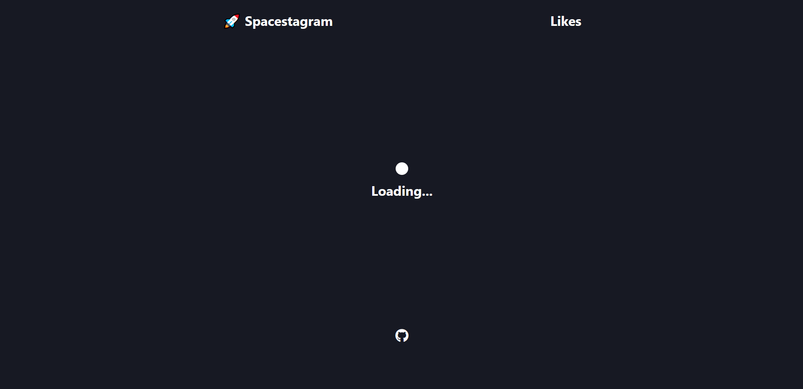
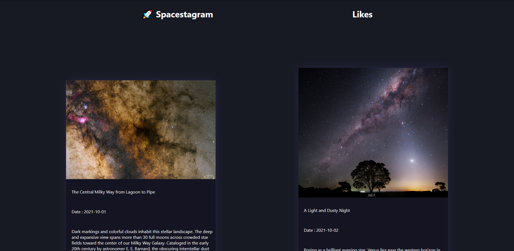
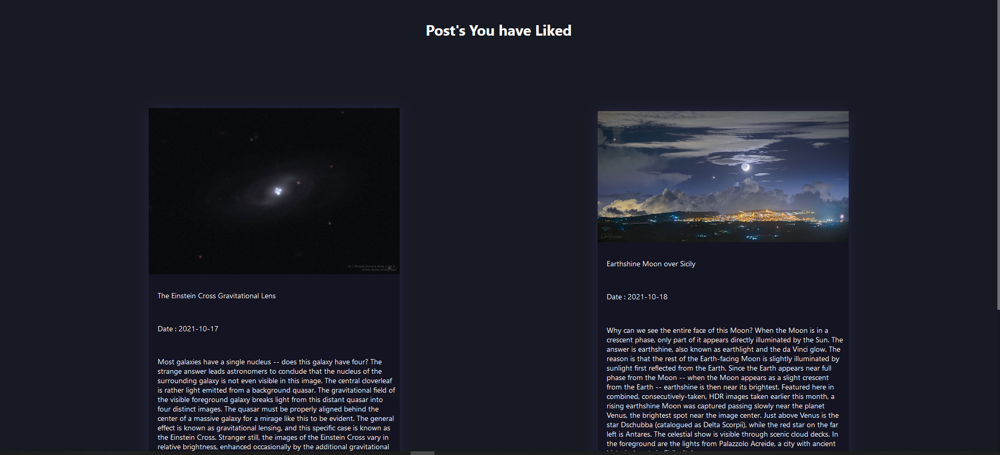

# Spacestagram

Spacestagram built using ReactJS. It fetch the Images and it's metadata From NASA Api
 * User can Share Images
 * User can like Post and See their Liked images on Like Page

# Screenshots

## Loading State


## Images 


## Like Page



# Get API Key

[NASA API](https://api.nasa.gov)


# Run Locally
Clone the repo
```shell
git clone https://github.com/0xdevsachin/Spacestagram.git
```
Create `.env.local` file in folder add api key
```shell
REACT_APP_API_KEY=
```
Install Node modules 
```
npm install
```
Run Project
```shell
npm start

```


